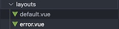

Layout System
=============

.. include:: ../style.rst

:green:`Layout`

Overview
--------

The app has three layouts: **default**, **empty**, and **error**.

Layout Files
------------

.. code-block:: text

    frontend/layouts/
    ├── default.vue           # Main app layout with navigation
    ├── empty.vue             # Simple layout for standalone pages
    └── error.vue             # Error page layout

Default Layout
--------------

Main application layout with navigation panels:

.. code-block:: vue

    <template>
      <v-app>
        

          <!-- Left Panel + Content -->
          

            

              <left-pane />
            

            

              <Nuxt />  <!-- Page content -->
            

          

          
          <!-- Bottom Navigation -->
          

            <navigation />
          

        

      </v-app>
    </template>

**Components:**
- **Left Panel**: Topic navigation and menu
- **Content Panel**: Page content area, displayed based on the page content (model or other components)
- **Navigation**: Bottom navigation bar

**Used by:** Content pages, model pages, video pages

Empty Layout
------------

Simple layout without navigation:

.. code-block:: vue

    <template>
      <Nuxt/>
    </template>

**Used by:** Landing page, about page, error pages

Error Layout
------------

Handles application errors:

.. code-block:: vue

    <template>
      <v-app dark>
        

          <h1 v-if="error.statusCode === 404">Page not found</h1>
          <h1 v-else>An error occurred</h1>
          <NuxtLink to="/">Go home</NuxtLink>
        

      </v-app>
    </template>

Layout Usage
-----------

Pages specify layout with `layout` property:

.. code-block:: javascript

    // Default layout (with navigation)
    export default {
      layout: 'default'
    }
    
    // Empty layout (no navigation)
    export default {
      layout: 'empty'
    }

**Rules:**
- **No layout specified** → Uses default layout
- **`layout: 'empty'`** → No navigation panels
- **Error pages** → Automatically use error layout

Responsive Features
------------------

- **Desktop**: Side-by-side panels
- **Mobile**: Stacked layout
- **Panel height**: Automatically adjusts to screen size
- **Fullscreen**: F11 key support

Key Points
----------

1. **Default layout** = Navigation + Content
2. **Empty layout** = Content only
3. **Error layout** = Error handling
4. **Responsive** = Works on all screen sizes
5. **Easy to use** = Just add `layout: 'layoutName'` to pages

