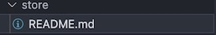

Store
=====

.. include:: ../style.rst

:green:`STORE`

State Management Architecture
-----------------------------

The application uses **Vuex** for centralized state management, providing predictable state mutations and improved component communication.

Core Store Structure
--------------------

**Main Store** (``store/index.js``):
   - Application-wide content state
   - Current page content management
   - Chart loading states

**Model Store Module** (``store/model.js``):
   - 3D model configuration and states
   - Rendering and performance settings
   - Color mapping and visualization controls
   - Loading and error state management
   - Waveform data synchronization

Key Features
------------

- **Centralized State**: All 3D model states managed in dedicated module
- **Reactive Updates**: Automatic component synchronization via getters
- **Error Handling**: Unified error state management across components
- **Performance Optimization**: Efficient state updates and minimal re-renders

State Management Benefits
-------------------------

1. **Predictable Data Flow**: Single source of truth for all model states
2. **Component Decoupling**: Reduced prop drilling and event bubbling
3. **Developer Experience**: Better debugging with Vue DevTools integration
4. **Maintainability**: Clear separation of concerns and modular architecture

Usage Pattern
-------------

Components access state through **mapGetters** and update via **mapActions**:

.. code-block:: javascript

   // Component integration
   computed: {
     ...mapGetters('model', ['getModelStates', 'isModelReady'])
   },
   
   methods: {
     ...mapActions('model', ['updateColorMapping', 'loadModel'])
   }

This architecture ensures efficient state synchronization between complex 3D model components and UI controls.
