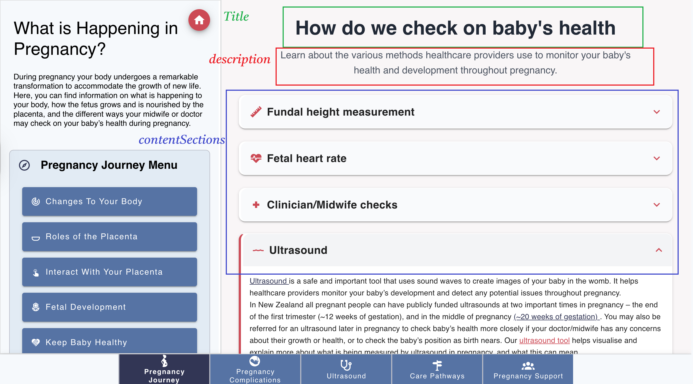
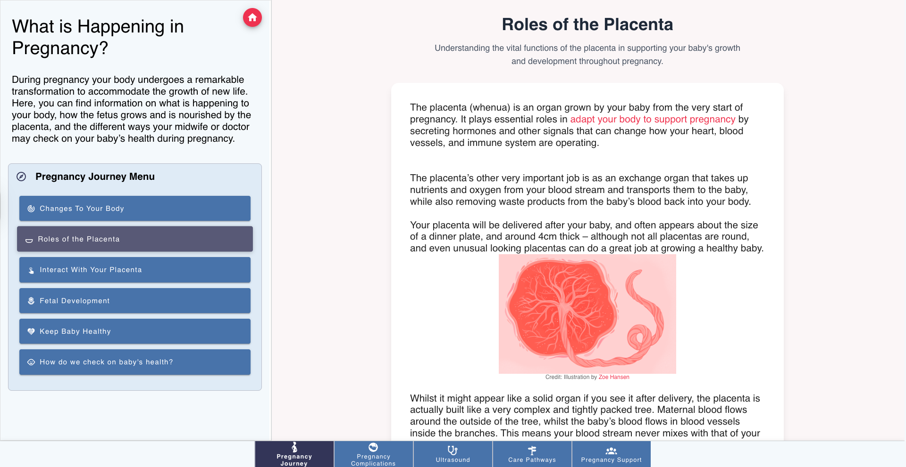
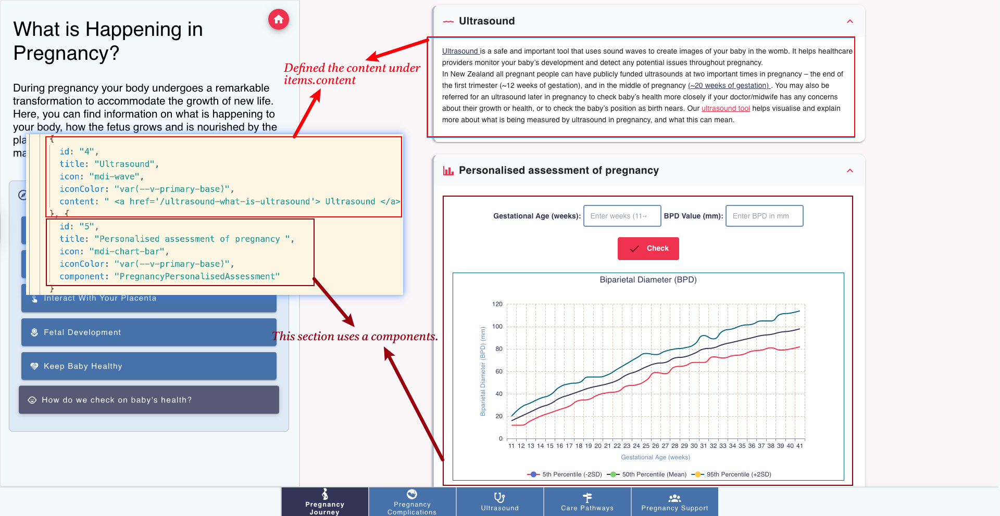

Pages Structure
==============

.. image:: images/05_pages.jpg
.. include:: ../style.rst

:green:`PAGES`

Overview
--------

The pregnancy app uses a dynamic routing system with content-driven pages. The main entry point redirects to a landing page, while all topic pages are generated dynamically through a slug-based routing system.

Page Organization
----------------

.. code-block:: text

    frontend/pages/
    ├── index.vue                    # Root entry point (redirects to landing)
    ├── landing/                     # Landing page components
    │   └── index.vue               # Main landing page
    ├── about/                       # About page
    └── _slug/                       # Dynamic route handler
        ├── index.vue                # Dynamic page component
        └── pageData/                # Content data files
            ├── pageDataLoader.js    # JSON data loader
            └── json/                # JSON data files
                ├── index.json       # Content mapping
                ├── pregnancy-*.json # Pregnancy-related content
                ├── conditions-*.json# Medical condition content
                ├── ultrasound-*.json# Ultrasound-related content
                ├── clinical-*.json  # Clinical care content
                └── support-*.json   # Support services content

The pageData folder contains the content data files for the pages. The file name should be the same as the slug/route name. All page data files are now stored in JSON format for better maintainability and performance.

**JSON Data Loading**

The application uses a custom JSON data loader (``pageDataLoader.js``) to dynamically load page data from JSON files. This approach provides:

- **Lazy Loading**: Page data is loaded only when needed
- **Better Performance**: JSON files are parsed faster than JavaScript modules, and can be used in other languages like Python, Java, etc.
- **Easier Maintenance**: JSON format is more straightforward to edit and validate
- **Consistent Structure**: All data files follow the same JSON schema

Each page data file contains:

.. code-block:: json

    {
        "title": "Sample",
        "description": "Sample",
        "showModel": false,
        "contentSections": [
            {
                "id": "1",
                "title": "Sample",
                "icon": "mdi-heart-plus",
                "iconColor": "var(--v-primary-base)",
                "content": "Sample"
            },
            {
                "id": "2",
                "title": "Fetal Development",
                "icon": "mdi-baby-face",
                "iconColor": "var(--v-primary-base)",
                "component": "PregnancyFetalDev"
            }
        ]
    }

See the image below for the page data structure:

If there is only one item in this page, it will be displayed as an article, looks like this:

The content of the section can be ``content`` or ``component``. The content rendered by ``ContentPane.vue`` file, using html, therefore for simple content, you can directly use the ``content`` by setting the content in this js file.

If you want to use a component, you can use the ``component`` property by putting the name of the component, and store the component in the ``frontend/components/content`` folder.

For example, the image below shows one section using component and the other one using html content:

Component Selection
~~~~~~~~~~~~~~~~~~

The system automatically selects components based on:

1. **Model pages**: `showModel: true` → `RightPane` component
2. **Custom components**: `component` specification, will use a component from `frontend/components/content` folder
3. **Default fallback**: `ContentPane` component
