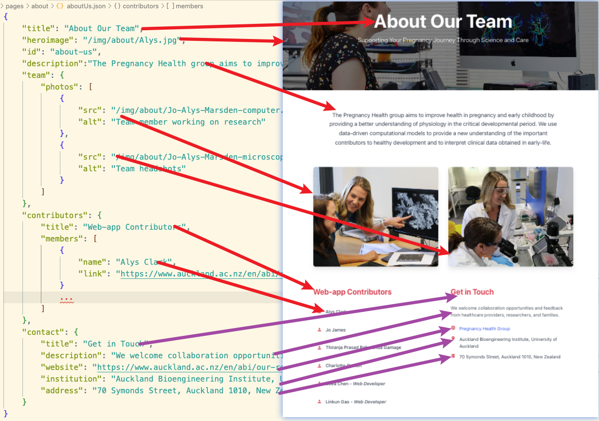

Pages
=====

This document describes the different pages and their structure in the pregnancy application.

Landing Page
-----------

The landing page is the first page that users see when they access the app. It consists of three main sections:

**Five Cards**
    By clicking a card, users can navigate to the corresponding page. The title, background, icon, and content are stored in ``landingPageData.json``. Adding or updating this file will automatically update the cards on the landing page.
    Below is how the card data is structured, 

    .. image:: images/00_landing_page.png

**Menu**
    Located in the upper left corner, there is a menu button that includes all main topics and their sub-topics. Menu items are rendered based on the ``topics.json`` file. 
    Below is how the menu data is rendered by the topic.json file.

    .. image:: images/00_menu.png

**Left Section**
    Contains the title and description of the app, the data also defined in the ``landingPageData.json`` file.

    .. image:: images/00_left_landing.jpg

Main Application
----------------

The main application is divided into three parts:

**Left Side & Bottom**
    The left side of the page contains the menu and introduction, rendered based on the ``topics.json`` file.
    The bottom of the page contains the main navigation, rendered based on the ``topics.json`` file.

    All the data for these sections are referred to the ``topics.json`` file like the following:

    .. image:: images/00_nav.png

**Right Side**
    The right side displays the main content of the page, rendered based on the ``pageData`` folder. Each page (at the sub-topic level) has its own data file and is rendered using the ``ContentPane.vue`` file.
    For more information, please refer to the :ref:`implementation_structure/06_pages:Pages Structure` document.

   

Core Features
~~~~~~~~~~~~

The application includes the following core features:

- Pregnancy Journey
- Ultrasound
- Care Pathways
- Pregnancy Complications
- Support

Data Configuration
~~~~~~~~~~~~~~~~~~
The data are stored under ``frontend/assets/data`` folder, please refer to the :ref:`implementation_structure/02_assets:Data Assets` document for more details about the data structure and configuration.

Content Rendering
~~~~~~~~~~~~~~~~
The content redering is data-driven, please refer to the :ref:`implementation_structure/06_pages:Pages Structure` document for more details about the content rendering.

About Us Page
-------------

The About Us page provides information about the research team behind the pregnancy application. 

The page data is stored in ``frontend/pages/about/aboutUs.json`` with the following structure:

    - ``title``: Main page title
    - ``heroimage``: Background image for the hero section
    - ``description``: Team description text
    - ``team.photos[]``: Array of team photos with src and alt attributes
    - ``contributors``: Object containing title, description, and members array
    - ``contact``: Object containing title, description, email, institution, and address

The image below shows the data structure of the about us page:

