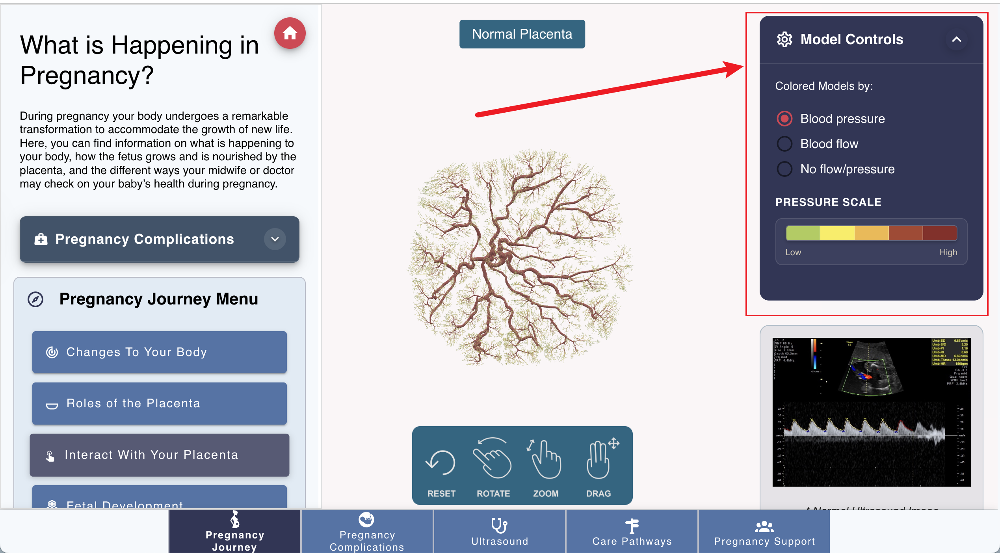

How to control the model
========================

At the right side of the app, there is a panel controls, click the arrow button to open the panel.
This panel is defined at the ``frontend/components/model/PanelControls.vue``. 

Under the model, there is a color mapping scale, which is used to show the color mapping of the pressure or flux.
When click the "Pressure", the color mapping will be the pressure, when click the "Flux", the color mapping will be the flux.
The default means that the color of the arterial vessels is red, and the color of the venous vessels is blue.

The color mapping is according to the definition in ``VTK`` file. And the logic of redering the color is in the ``frontend/utils/vtkLoader.js``, for color definition, please refer to the :ref:`pregnancy_app/02_model_config:Color Mapping` document.

