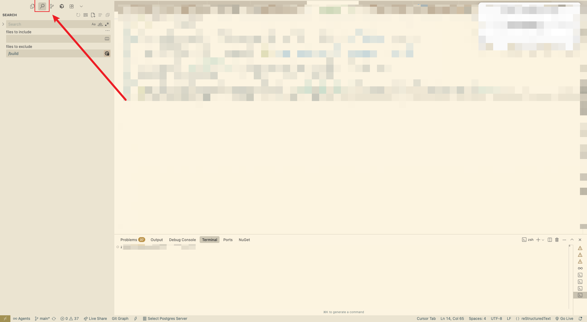
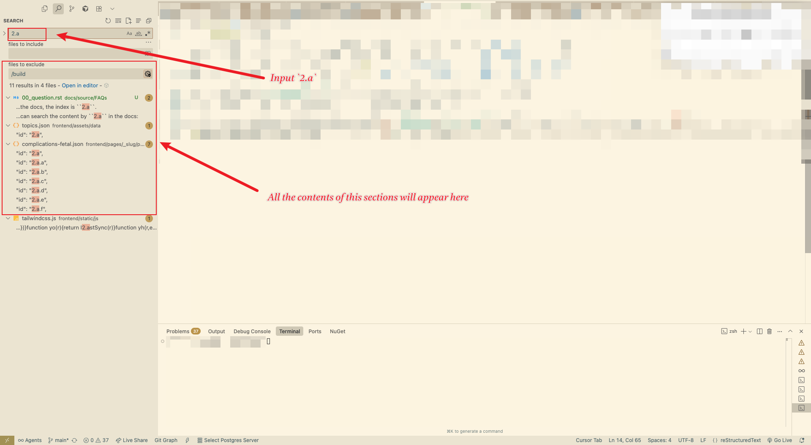

What if I want to change the content of the page?
===============================================

.. include:: ../style.rst

You can change the content of the page by editing the json file in the `pageData/json` folder.

Refer to this document for more details: :ref:`implementation_structure/06_pages:Pages Structure`

If you have the ``app content docs``, then you will have the "index" of the content.
You can using VSCode to search the content, and edit them like below:

1. For example, you want to update the content of ``Reduced fetal growth`` section, where in the docs, the index is ``2.a``.
2. In VSCode, you can search the content by ``2.a`` in the docs:

3. Then you can see all the content which related to this section, and you can edit them according to :ref:`pregnancy_app/00_pages:Pages`, where shows the corresponding rerlations between page and json file.

4. Then you can see the updated content in the app.