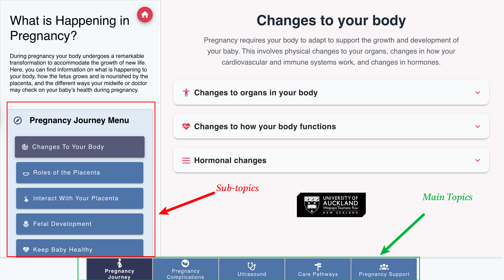
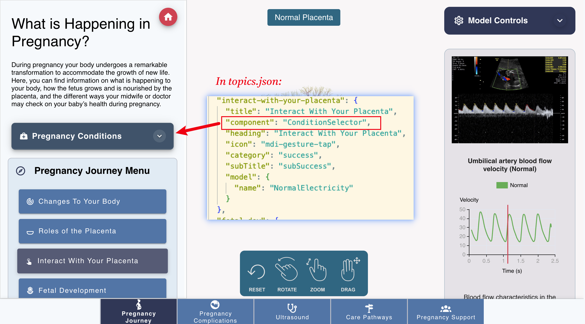

Implementation
=============

.. include:: ../style.rst

Introduction
-----------

This document provides a brief overview of the new pregnancy web-app. The app will be built using Vue2. Basically, it will cover main components and data files of the application. There might be some other small components (to facilitate reusability) that I may not mention here, as this document is primarily aimed to show the way the data will be saved and the flow of information (called as props in vue.js) among main components.

**Terminologies:** Main tabs like (Pregnancy Journey, Pregnancy Complications etc) are referred to as "topics". The sub tabs like (Changes to your body, Placenta etc) are referred as "Subtopics".

See the image below for more details:

Data Files
----------

The data will be saved in the following files:

**Topics.json**, containing information related to topics and their subtopics:

.. code-block:: json

    "pregnancy": {
        "title": "Pregnancy Journey",
        "component": "none",
        "heading": "What is Happening in Pregnancy?",
        "content": "During pregnancy your body undergoes a remarkable transformation to accommodate the growth of new life. Here, you can find information on what is happening to your body, how the fetus grows and is nourished by the placenta, and the different ways your midwife or doctor may check on your baby's health during pregnancy.",
        "icon": "/img/landing/pregnancy.svg",
        "subTopics": {
            "changes": {
                "title": "Your Body",
                "component": "none",
                "heading": "Changes To Your Body",
                "icon": "mdi-radar",
                "category": "success",
                "subTitle": "subSuccess",
                "model": {
                    "name": "NoInfarct"
                }
            },
            "placenta": {
                "title": "Placenta",
                "component": "none",
                "heading": "Roles of the Placenta",
                "icon": "mdi-bowl-outline",
                "category": "success",
                "subTitle": "subSuccess",
                "model": {
                    "name": "NoInfarct"
                }
            }
        }
    }

**Data Structure Explanation:**

- **Topic name**: Consists of a route, under this case here, there would be one main route: :red:`pregnancy`
- **Content**: The content for this topic and will display on frontend left panel
- **SubTopics**: The subtopics for this topic, also consist of a route, display on the left panel as menu item
- **Title**: For topic will display on main navigation. For sub-topics, this is the main item title
- **Heading**: The heading for this main-topic and will display on frontend left panel
- **Icon**: The nav bar icon, you can find more on :red:`https://pictogrammers.com/library/mdi/`
- **Category**: The color for this topic. You can define your own color on :red:`nuxt.config.js` file Vuetify config
- **Component**: The component for this topic, if want the left side show a component, set the name of the component here, for example, if the topic needs to include pregnancy conditions, set the component to :red:`ConditionSelector` as shown in the image below:

- **Model**: Model name
- **Customization**: You also can customise the key:value for yourself, but after this you need to setup it under :red:`./frontend/plugins/current-content.js`, then you can use it in vue files via :red:`this.$key()`, e.g. :red:`this.$category()`

Application Structure
--------------------

The main app will be split into left and right pane (as it is currently).

**Left Pane** includes:

- Go home button
- Main Heading
- Content
- Panel (component)
- SubMenu (the tabs and subtabs populated based on topics.json)

**Right Pane** will switch between two type of pages i.e. :red:`content` and :red:`Model`.

