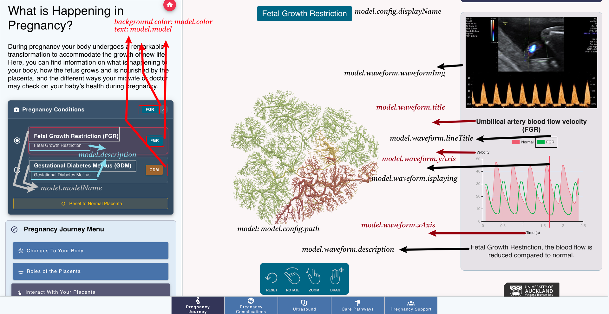
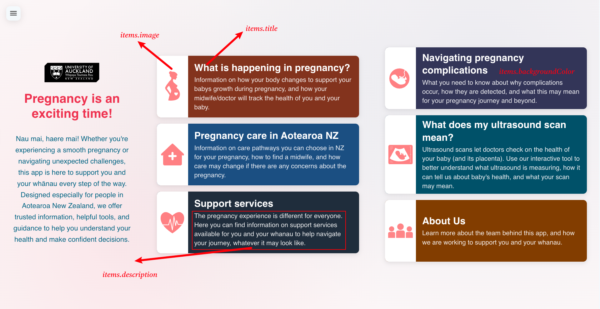

Assets Structure
===============

There are three main data assets:
- data: for page content management and configuration
- images, I won't cover this here since it is straightforward to understand.
- sass: for styling

Data Assets
-----------

.. code-block:: text

    frontend/assets/data/
    ├── modelData.json        # 3D model configs and waveform data, used in model component
    ├── landingPageData.json  # Landing page content, used in landing page
    ├── supportData.json      # Support services info, used in support-services page
    └── topics.json           # Educational content structure

Model Configuration
~~~~~~~~~~~~~~~~~~

The `modelData.json` file contains comprehensive configurations for 3D models and their associated data:

The first model is the default model, following this format to add more models by just using data, and the interface will be updated automatically.

.. code-block:: json

    "models": [
        {
        "model": "normal", 
        "modelName": "Normal",
        "Description": "Normal Placenta", 
        "color": "error",
        "config": {
            "path": "/model/normal.vtk",
            "displayName": "Normal Placenta",
            "color": 16716066,
            "opacity": 1.0,
            "modelSize": 420,
            "useCylinderGeometry": true,
            "cylinderSegments": 10
        },
        "waveform": {
            "xAxis": "Time (s)",
            "xDataPath": "/waveforms/normal/time.csv",
            "yAxis": "Velocity",
            "lineTitle": "Normal",
            "yDataPath": "/waveforms/normal/signal.csv",
            "waveformImg": "/img/normal-ultrasound.jpg",
            "title": "Umbilical artery blood flow velocity (Normal)",
            "isPlaying": true,
            "speed": 1,
            "waveformNote":"* Normal Ultrasound Image",
            "description": "Blood flow characteristics in the umbilical cord can reflect the health of the fetus",
            "colors": {
            "normal": "#4CAF50",
            "colorblind": "#2196F3"
            },
            "timeOffset": 1.45
        }
        },
    
    ]

See the image below for the model confign and the elements on the page:

Below is the explanation of the key:value pairs:

The `modelData.json` file contains configuration for 3D medical models. Here are the key:value pairs:

**models**: Array containing all medical model configurations

**model**: Unique identifier for the model (normal, FGR, GDM), displayed as the tag for the condition selector

**modelName**: Display name for the model

**Description**: Brief description of the medical condition

**color**: The background color of the tag for the condition selector

**config**: Model visualization settings
  - **path**: Path to VTK 3D model file
  - **displayName**: Name shown in the interface
  - **color**: RGB color value for the model, if no flux/pressure color, this color will be used
  - **opacity**: Transparency level (0.0-1.0)
  - **modelSize**: Size of the 3D model
  - **useCylinderGeometry**: Whether to use cylinder geometry
  - **cylinderSegments**: Number of cylinder segments
  - **defaultRotationY**: Default Y-axis rotation since some models are not facing the camera defaultly

**waveform**: Blood flow data configuration
  - **xAxis**: X-axis label for the chart
  - **xDataPath**: Path to time data CSV file
  - **yAxis**: Y-axis label for the chart
  - **yDataPath**: Path to velocity data CSV file
  - **lineTitle**: Title for the waveform line at the legend
  - **title**: Chart title
  - **waveformImg**: Path to ultrasound image
  - **isPlaying**: Whether animation of playhead starts playing 
  - **speed**: Animation playback speed
  - **waveformNote**: Note displayed with the image
  - **description**: Medical description of the condition
  - **colors**: Color scheme for normal and colorblind users
  - **timeOffset**: Time offset for data synchronization, so that the heart beat waveform is aligned

Landing Page Configuration
~~~~~~~~~~~~~~~~~~~~~~~~~

The `landingPageData.json` file contains the configuration for the landing page:

.. code-block:: json
   
  "title": "Pregnancy is an exciting time!",
  "description": "Nau mai, haere mai! Whether you're experiencing a smooth pregnancy or navigating unexpected challenges, this app is here to support you and your whānau every step of the way. Designed especially for people in Aotearoa New Zealand, we offer trusted information, helpful tools, and guidance to help you understand your health and make confident decisions.",
  "items": [
    {
      "index": 0,
      "title": "What is happening in pregnancy?",
      "description": "Information on how your body changes to support your babys growth during pregnancy, and how your midwife/doctor will track the health of you and your baby.",
      "image": "/img/landing/pregnancy.svg",
      "backgroundColor": "#7A3520",
      "link": "/pregnancy-changes"
    },
    {
      "index": 3,
      "title": "Navigating pregnancy complications",
      "description": "What you need to know about why complications occur, how they are detected, and what this may mean for your pregnancy journey and beyond.",
      "image": "/img/landing/embryo_icon.svg",
      "backgroundColor": "#313657",
      "link": "/complications-fetal"
    },
  ]

- **index**: the index of the item, used to sort the items (from left to right, from top to bottom)
- **title**: the title of the card item
- **description**: the description of the card item
- **image**: the image at the left side of the card, store the image under `frontend/static/` and add the path here, you can use an icon instead of an image, just add the mdi icon name here.
- **backgroundColor**: the background color of the item
- **link**: define the page to navigate to when the item is clicked

See the image below for the landing page configuration and the elements on the page:

Support Services Configuration
~~~~~~~~~~~~~~~~~~~~~~~~~~~~

The `supportData.json` file drives the Support Services page (rendered by `frontend/components/content/Support.vue`).

Location: `frontend/assets/data/supportData.json`

Schema overview
^^^^^^^^^^^^^^^

- **regions**: List of region names shown in the region selector.
- **regionalServices**: Map of region → list of services available in that region.
  - Key must match exactly one of the items in `regions`.
  - Each value is a list of strings (service names) displayed when a region is selected.
  - If a region has no entry, a sensible default list is shown in the UI.

Example
^^^^^^^

The following illustrates a minimal but complete configuration:

.. code-block:: json

  {
    "regions": [
      "Auckland",
      "Canterbury",
      "Waikato"
    ],
    "regionalServices": {
      "Auckland": [
        "Auckland City Hospital Maternity Services",
        "National Women's Health - Auckland City Hospital"
      ],
      "Canterbury": [
        "Christchurch Women's Hospital",
        "Pegasus Health Maternity Services"
      ]
    },
    "serviceSections": [
      {
        "key": "general",
        "icon": "mdi-account-group",
        "color": "success",
        "title": "For Everyone Pregnant",
        "description": "Services that help you navigate pregnancy and connect with appropriate care:",
        "regional": true
      },
      {
        "key": "specialist",
        "icon": "mdi-medical-bag",
        "color": "warning",
        "title": "Specialist Support Services",
        "items": [
          {
            "icon": "mdi-brain",
            "color": "accent",
            "title": "Mental Health Support Services",
            "description": "Specialized mental health support during pregnancy:",
            "list": [
              "Perinatal mental health services",
              "Counselling and therapy services"
            ]
          }
        ]
      },
      {
        "key": "resources",
        "icon": "mdi-book-open-variant",
        "color": "accent",
        "title": "Additional Resources & Contacts",
        "resources": [
          {
            "icon": "mdi-phone",
            "color": "primary",
            "title": "Emergency Contacts",
            "subtitle": "24/7 support services",
            "content": [
              { "label": "Emergency", "value": "111" },
              { "label": "Healthline", "value": "0800 611 116" }
            ]
          }
        ]
      }
    ]
  }

Notes
^^^^^

- Icons use Material Design Icons (e.g., `mdi-account-group`).
- Colors may use Vuetify theme names (e.g., `primary`, `success`, `warning`) or project CSS variables.
- To add a region, update `regions` and optionally add a matching entry in `regionalServices`. Missing regions fall back to default items in the UI.
- The Support Services page route is defined via page data at `frontend/pages/_slug/pageData/json/support-services.json`, which references the `Support` component.

Styling Assets
--------------

.. code-block:: text

    frontend/assets/sass/
    ├── global.scss           # Global styles
    ├── base.scss             # Base styles
    ├── variables.scss        # Theme variables
    ├── _mixins.scss         # Reusable mixins
    ├── components/           # Component styles
    └── pages/                # Page styles

Image Assets
-----------

.. code-block:: text

    frontend/assets/images/
    ├── gestures-icons.png    # UI icons
    ├── medtechcore-abi-logo.png
    ├── headshots.png         # Team photos
    ├── kiwirous.png         # Branding
    ├── funding-abi-medtech.png
    ├── Annie-Jones.png      # Team member
    └── Liz-Broadbent.png    # Team member

