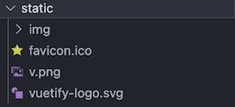

Static
======

.. include:: ../style.rst

:green:`STATIC`

- static folder is home for external javascript files containing zinc, dojo charts and models data.
- models and waveforms are stored in the static folder linked to the model page by the ``modelData.js``files.
- images are used to store images, the laning folder contains the images for the landing page, imported by the ``landingPageData.js`` file.
- Reorganisation of content in this folder is recommended.
