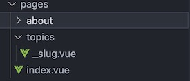

Pages Structure
==============

.. include:: ../style.rst

:green:`PAGES`

Overview
--------

The pregnancy app uses a dynamic routing system with content-driven pages. The main entry point redirects to a landing page, while all topic pages are generated dynamically through a slug-based routing system.

Page Organization
----------------

.. code-block:: text

    frontend/pages/
    ├── index.vue                    # Root entry point (redirects to landing)
    ├── landing/                     # Landing page components
    │   └── index.vue               # Main landing page
    ├── about/                       # About page
    └── _slug/                       # Dynamic route handler
        ├── index.vue                # Dynamic page component
        └── pageData/                # Content data files
            ├── index.js             # Content mapping
            ├── pregnancy-*.js       # Pregnancy-related content
            ├── conditions-*.js      # Medical condition content
            ├── ultrasound-*.js      # Ultrasound-related content
            ├── clinical-*.js        # Clinical care content
            └── support-*.js         # Support services content

The pageData folder contains the content data files for the pages. The file name should be the same as the slug/route name.

Each page data file contains:

.. code-block:: javascript

    export default {
        title: 'Sample', // the title of the page, shows in the left side of the page
        description: 'Sample', // the description of the page, shows in the left side of the page
        showModel: false, // if true, the model will be shown in the content pane
        contentSections: [
            {
                id: "1", //id must be unique
                title: "Sample",
                icon: "mdi-heart-plus", //icon must be a valid mdi icon
                iconColor: "var(--v-primary-base)", //iconColor must be a valid css color or a variable
                content: "Sample" // the content of this section, can be HTML or plain text
            },
            {
                id: "2",
                title: "Fetal Development",
                icon: "mdi-baby-face",
                iconColor: "var(--v-primary-base)",
                component: "PregnancyFetalDev" // the name of the component, stored in the ``frontend/components/content`` folder
            }
        ]
    };

See the image below for the page data structure:

.. image:: images/06_page_structure.png

If there is only one item in this page, it will be displayed as an article, looks like this:

.. image:: images/06_single_section.png

The content of the section can be ``content`` or ``component``. The content rendered by ``ContentPane.vue`` file, using html, therefore for simple content, you can directly use the ``content`` by setting the content in this js file.

If you want to use a component, you can use the ``component`` property by putting the name of the component, and store the component in the ``frontend/components/content`` folder.

For example, the image below shows one section using component and the other one using html content:

.. image:: images/06_section_use_component.png

Component Selection
~~~~~~~~~~~~~~~~~~

The system automatically selects components based on:

1. **Model pages**: `showModel: true` → `RightPane` component
2. **Custom components**: `component` specification, will use a component from `frontend/components/content` folder
3. **Default fallback**: `ContentPane` component
