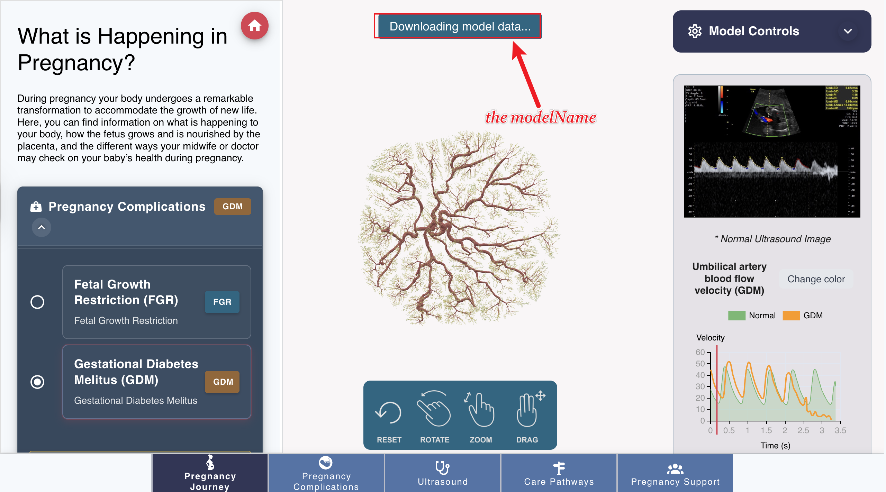

How to add the model to the web app
====================================

This is a guide on how to load the model into the app, for model configuration or add new model, please refer to the :ref:`implementation_structure/02_assets:Model Configuration` document.

Loading the model
----------------

We are using three.js and cropper3D.js in the app. For overall 3D model loading, please refer to the :doc:`display model <../implementation_structure/09_display_model>`. In this document, we will focus on the VTKLoader and how to load the VTK models.

Initialization the VTKLoader
~~~~~~~~~~~~~~~~~~~~~~~~~~~~

1. Create the scene, for more details, please refer to the `three.js scene <https://threejs.org/docs/#manual/en/introduction/Creating-a-scene>`_

   .. code-block:: javascript

      this.scene = this.baseRenderer.getSceneByName('placental-scene');
      if (this.scene === undefined) {
        this.scene = this.baseRenderer.createScene('placental-scene');
        this.baseRenderer.setCurrentScene(this.scene);
      }

2. Initialize the VTKLoader, add the scene to the VTKLoader

   .. code-block:: javascript

      this.vtkLoader = new VTKLoader(this.THREE, this.scene.scene);

3. Initialize the Copper3D scene, which is used to control the camera

   .. code-block:: javascript

      this.vtkLoader.setCopperScene(this.scene);

Camera positions and orientations are stored in ``/static/modelView/``.

Call the VTKLoader to load the model
~~~~~~~~~~~~~~~~~~~~~~~~~~~~~~~~~~~

In the ``frontend/components/model/Model.vue`` file, we can call the ``loadVTKFile`` function to load the model.

.. code-block:: javascript

   this.vtkLoader.loadVTKFile(vtkPath, {
     displayName: 'Custom Model Name', // the name of the model
     color: 0xff00ff, // the color of the model
     opacity: 0.9, // the opacity of the model
     modelSize: 420, // the size of the model
     useCylinderGeometry: true,
     defaultRotationY: config.defaultRotationY || 0, // some model may need to be rotated default, so we can set the default rotation angle here
     onProgress: (message, progress) => {
       // update the progress of the model loading
     },
     onComplete: (mesh) => {
       // update the model loading complete, this is used to update the model loading complete in the UI
     }
   }); 

Update the model information
----------------------------

Once the state of model loading is changed (e.g. compelete loading / on progress loading / error loading), we can update the model information by calling the ``model-state-updated`` event.

   Below is the example of the ``model-state-updated`` event:

   .. code-block:: javascript

      onProgress: (message, progress) => {
       // update the progress of the model loading
        this.$emit('model-state-updated', {
          modelName: 'Downloading model data...'
        });
      },
      

Then the modelName will be updated to ``Downloading model data...`` in the UI. 
The modelName is desplayed at the top of the model viewport like the following:

By default, the modelName is defined in the ``modelData.json`` file, you can change the modelName by updating the ``modelData.json`` file.